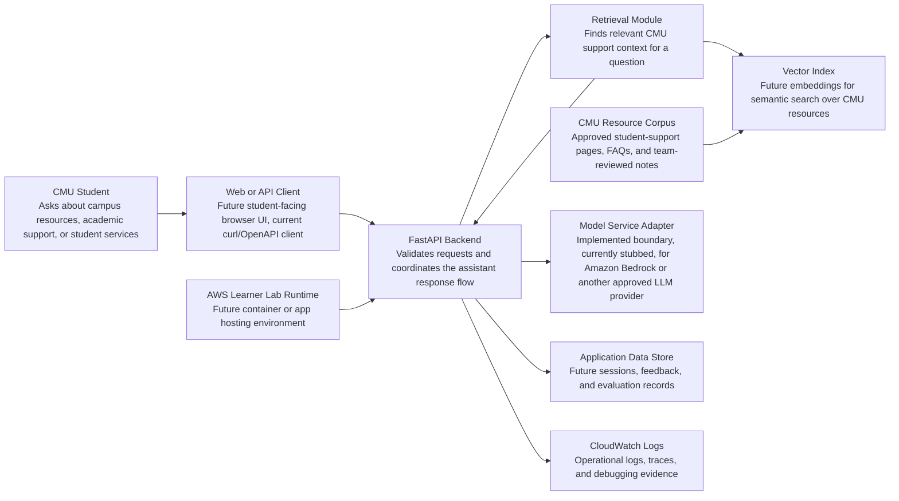

# Architecture Diagram

## Component Descriptions

- **CMU Student:** Asks a natural-language question about CMU resources, academic support, or student services.
- **Web or API Client:** Calls the backend; currently this can be Swagger UI or curl, later a student-facing web UI.
- **FastAPI Backend:** Owns request validation, response formatting, and orchestration.
- **Retrieval Module:** Implemented RAG boundary (`app/retrieval/`) that retrieves CMU support context before generation; currently returns stub documents.
- **CMU Resource Corpus:** Planned source collection of approved or team-reviewed student-support documents.
- **Vector Index:** Planned embedding-backed index for semantic search over the CMU resource corpus.
- **Model Service Adapter:** Implemented boundary (`app/model/`) for calling a real model service without rewriting the API; currently returns a stubbed answer.
- **Application Data Store:** Planned persistence for sessions, feedback, questions, answers, and evaluation records.
- **CloudWatch Logs:** Planned observability layer for debugging and accountability.
- **AWS Learner Lab Runtime:** Planned cloud environment for deployment in the Academy Learner Lab sandbox.
